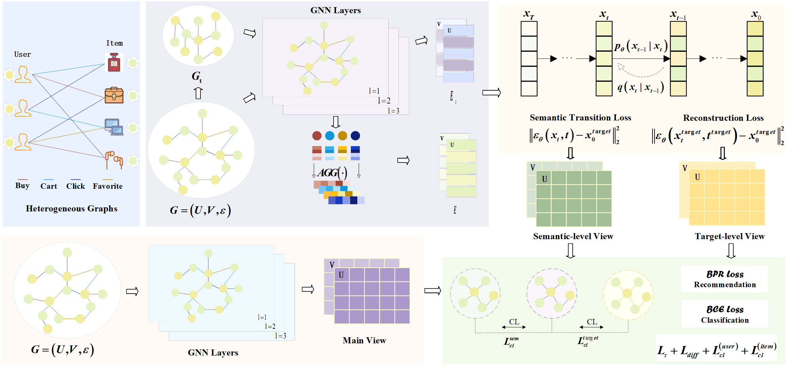
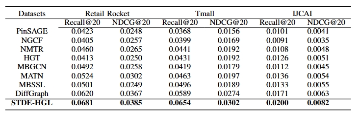
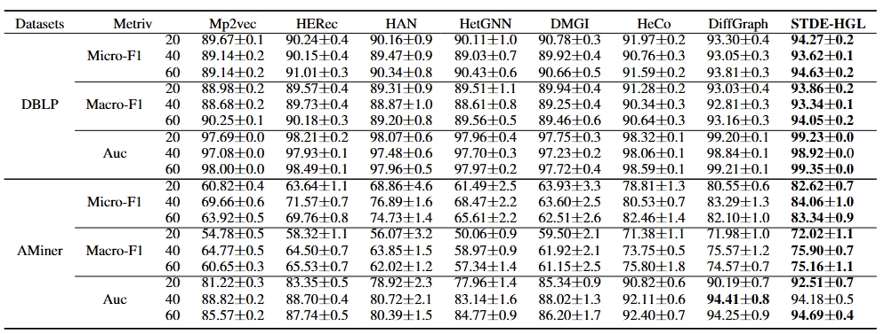

# STDE-HGL: Diffusion-Enhanced with Semantic Transitions Heterogeneous Graph Learning



 [DiffGraph] The predecessor of this work: [**DiffGraph: Heterogeneous Graph Diffusion Model**](https://dl.acm.org/doi/10.1145/3701551.3703590) can be found [here](https://github.com/HKUDS/DiffGraph).

## 📝 Environment

We develop our codes in the following environment or install all dependencies listed in *requirements.txt*:

- CUDA==12.1

- python==3.9.21

- torch==2.3.1

  

## 📚 Datasets

|    Dataset    |  User  |  Item  |   Link   |       Interactions Types       |
| :-----------: | :----: | :----: | :------: | :----------------------------: |
| Retail Rocket | 2,174  | 30,113 |  97,381  |    View, Cart, Transaction     |
|     Tmall     | 31,882 | 31,232 | 1,451,29 | View, Favorite, Cart, Purchase |
|     IJCAI     | 17,435 | 35,920 | 799,368  | View, Favorite, Cart, Purchase |

|      |     Node      | Metapath |        |      Node       | Metapath |
| :--: | :-----------: | :------: | :----: | :-------------: | :------: |
| DBLP |  Author:4057  |   APA    | AMiner |   Paper:6564    |   PAP    |
|      |  Paper:14328  |  APCPA   |        |  Author:13329   |   PRP    |
|      | Conference:20 |  APTPA   |        | Reference:35890 |   POS    |
|      |   Term:7723   |          |        |                 |          |

## 🚀 How to run the codes

The command lines to train STDE-HGL on the two application domains are as below. The unspecified meters are set as default.

##### Retail Rocket

```python
python main.py --data retail_rocket --lr 1e-3 --gcn_layer 2 --latdim 128
```

##### Tmall

```python
python main.py --data tmall --difflr 0.1 --temp 0.8 --epoch 150
```

##### IJCAI

```python
python main.py --data ijcai_15 --steps 300 --temp 0.1 --latdim 256
```

##### DBLP

```python
python main.py --data DBLP --lr 1e-4 --temp 0.3 --ssl_reg 0.1 --steps 200
```

##### Aminer

```python
python main.py --data aminer --uugcn_layer 2 --difflr 1e-
```

## 👉 Code Structure

```
.
├──NC
|   ├──data
|   │   ├── aminer
|   │   └── DBLP
|   ├── Utils                    
|   │   ├── TimeLogger.py            
|   │   └── Utils.py
|   ├──DataHandler.py
|   ├── main.py
|   ├── Model.py
|   └── params.py
├──Rec
|   ├──data
|   │   ├── ijcai_15
|   │   ├── retail_rocket
|   │   └── tmall
|   ├── Utils                    
|   │   ├── TimeLogger.py            
|   │   └── Utils.py
|   ├──DataHandler.py
|   ├── main.py
|   ├── Model.py
|   └── params.py
├── framework.png
├── performance1.png
├── performance2.png
└── README
```

## 🎯 Experimental Results

Performance comparison of baselines on different datasets in terms of Recall@20 and NDCG@20:



Performance comparison of baselines on different datasets in terms of Micro-F1, Macro-F1, and AUC:



